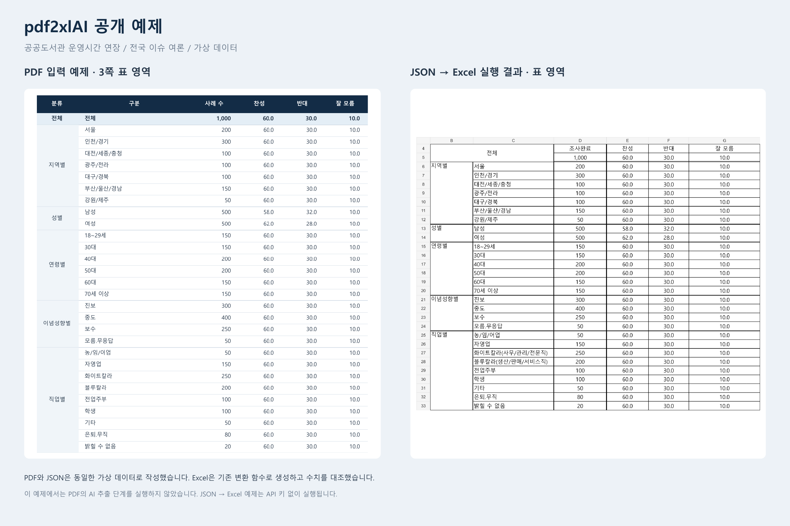

# PDF2XL

**여론조사 PDF의 표 데이터를 항목별 표준 Excel 파일로 변환하는 AI 기반 데스크톱 도구입니다.**

기관마다 다른 PDF 양식을 확인하고 데이터를 옮겨 적는 반복 작업을 줄이기 위해 개발했습니다. 하나의 PDF에 포함된 여러 조사 항목을 추출해, 각각의 Excel 파일로 정리합니다.

**지원 환경:** Windows / macOS · **Python:** 3.10 이상 · **실행 방식:** GUI · **앱 이름:** pdf2xlAI

## 주요 기능

| 기능 | 설명 |
| --- | --- |
| 항목별 추출 | 정당 지지도(PSR), 국정운영 평가(GE), 이슈별 여론(ISSUE) 선택 |
| 기관·조사유형 감지 | 파일명 기반 조사기관·전국·지방 유형 자동 감지 및 조사기관 수동 지정 |
| 표준 Excel 출력 | 기관별 용어·분류를 정규화하고 유형별 Excel 템플릿에 기록 |
| 데이터 검증 | 누락 데이터, 수치 범위, 응답 비율 합계 등 이상 여부 점검 |
| 작업 관리 | 진행률 표시, 중지, 실패 항목 재시도, 캐시 관리 |

## 처리 흐름

```text
여론조사 PDF
  → 페이지 이미지 변환·표 영역 추출
  → OpenAI 기반 표·조사 정보 추출
  → JSON 정규화·검증
  → 항목별 Excel 파일 생성
```

기관별 추출 규칙은 `config/`, Excel 양식은 `templates/`로 분리해 관리합니다.

## 예제

아래 자료는 공개용으로 작성한 **가상 데이터**이며, 실제 여론조사 결과가 아닙니다.



[샘플 PDF](examples/sample_poll.pdf) · [입력 JSON](examples/sample_issue.json) · [Excel 결과](examples/expected_result.xlsx) · [실행 코드](examples/run_example.py)

예제 스크립트는 **수동 작성한 JSON → Excel 변환만** 실행합니다. PDF 추출이나 OpenAI API 호출은 수행하지 않습니다.

저장소 루트에서 실행합니다.

```bash
python -m pip install openpyxl PyYAML
python examples/run_example.py
```

결과 파일: `output/examples/sample_issue.xlsx`

## 실행 방법

전체 PDF 변환에는 **Tkinter가 포함된 Python 3.10 이상, OpenAI API 키, Poppler**가 필요합니다. 저장소 루트에서 실행합니다.

```bash
python -m pip install -r requirements.txt
python gui.py
```

앱에서 **API 키 입력 → PDF 선택 → 기관·조사유형 및 추출 항목 확인 → 출력 폴더 선택 → 변환 시작** 순서로 사용합니다.

Poppler는 저장소에 포함되어 있지 않습니다. 설치·경로 설정은 [`config.py`](config.py)의 안내를 참고하세요.

## 현재 제한

- 조사유형 수동 선택은 현재 Excel 양식 선택에만 적용되며, PDF 추출 단계에서는 파일명으로 자동 감지한 유형을 사용합니다.
- [`main.py`](main.py)는 기존 CLI 진입점입니다. 현재 중간 JSON의 저장 경로와 읽기 경로가 달라 Excel 파일이 생성되지 않을 수 있으므로, 전체 PDF 변환은 GUI를 사용하세요.

## 기술 스택

`Python` · `Tkinter` · `OpenAI API` · `pdf2image / Poppler` · `pdfplumber` · `openpyxl` · `PyYAML` · `PyInstaller`

> 실제 PDF 분석 시 문서 이미지가 OpenAI API로 전송되며 사용 요금이 발생할 수 있습니다. PDF 양식과 이미지 품질에 따라 추출 오류가 발생할 수 있으므로, 결과는 원본과 대조해 확인해야 합니다. 기타기관은 사용자 확인이 필요한 부분 지원 범위입니다.
